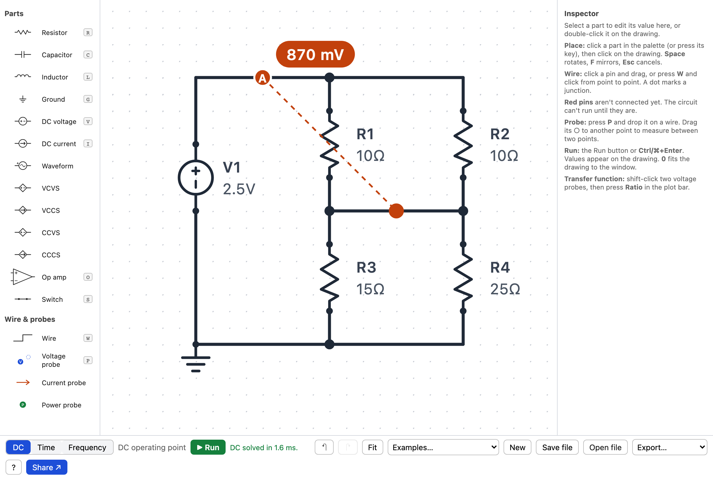
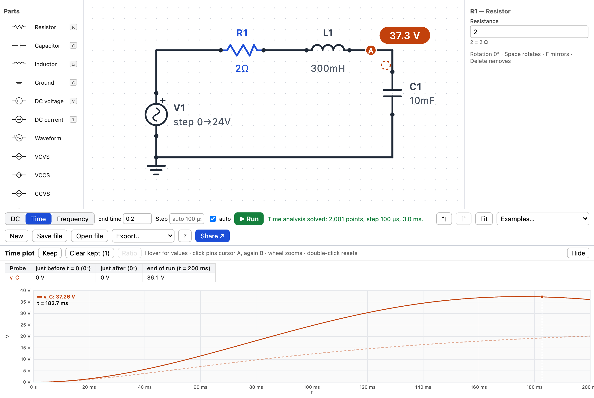
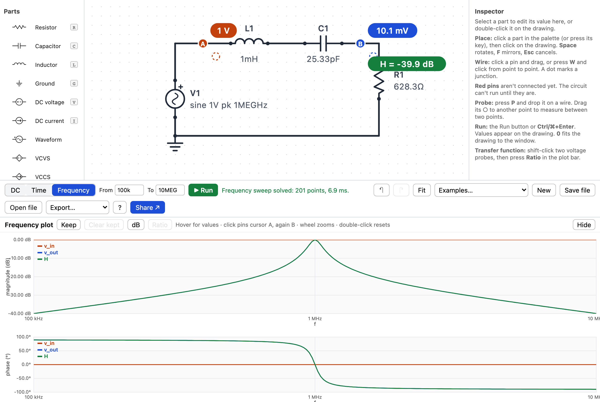
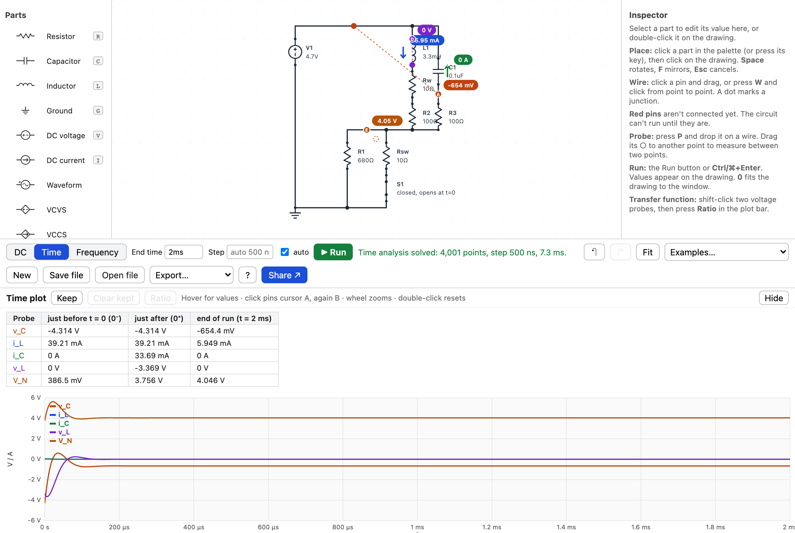
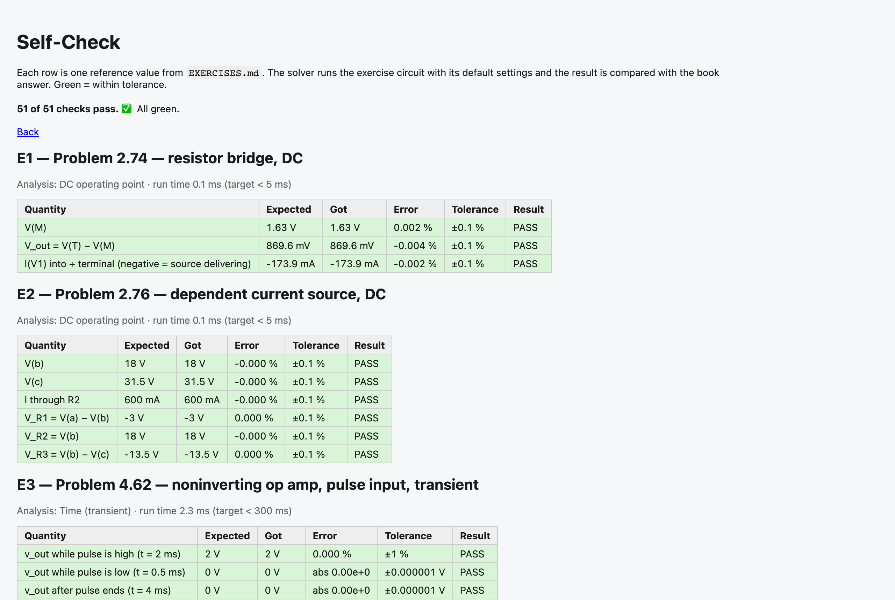

# CircuitWorks

A small, free, browser-based circuit simulator built around the exercises in
*Circuit Analysis and Design* (Ulaby, Maharbiz, Furse, 3rd ed.). Draw the
circuit from the book, press Run, and read the answers on the drawing. No
account, no server, no install: the whole app is static files.

**Live app:** https://laith4445.github.io/CircuitWorks/ (Self-Check page:
https://laith4445.github.io/CircuitWorks/#/selfcheck). Every push to `main`
rebuilds it.

**Status:** prototype. All seven proof-of-concept exercises (DC, dependent
sources, op amps, transients, frequency sweeps, switches, power) run and match
the book's answers. See `STATUS.md` for what works and how to check it.



## Try it

```bash
npm install
npm run dev
```

Open the address it prints. The **Help** button in the bottom bar (or the ? key) shows the keyboard reference.
The **Exercises…** menu offers each of the seven book exercises two ways:
*Try it yourself* (blank canvas, the problem text, and a Check button that
grades your probes against the book's answers) or as a *worked example*.

## What it does

- **Thirteen ideal parts** (R, L, C, sources, four dependent sources, ideal
  op amp, switch) and three kinds of probe (voltage, current, power). That is
  the entire palette; it fits on screen.
- **Three analyses**, named as the book names them: DC operating point, Time
  (transient) and Frequency (AC sweep).
- **Answers on the drawing.** Every probe shows its value in a badge. After
  the first run, editing a value re-runs by itself.
- **Plots with cursors** for Time and Frequency runs; **Keep** overlays the
  previous trace so you can compare, for example, three damping cases.



- **Bode plots** (dB and degrees on a log axis) and a **ratio probe** for
  transfer functions; zoom in to find the half-power points with the cursor.



- **Switches and initial conditions:** a Time run starts from the steady state
  with the switch in its starting position, flips it at t = 0, and tabulates
  every probe just before, just after, and at the end.



- **Wattmeter:** average power over whole cycles in a Time run, and power as a
  plotted quantity in a Frequency sweep.
- **It tells you what's wrong.** Unwired pins are red; a missing ground offers
  a one-click fix; impossible circuits are explained in plain words with the
  offending parts highlighted.
- **Sharing:** the circuit lives in the page link. Copy the link, that's the
  share. Save/Open as a file. Export the drawing as PNG/SVG and plots as PNG.

## Checking that the physics is right

`npm test` runs 176 checks: every reference value in `EXERCISES.md`, current
balance at every node, power balance, and an energy check. The in-app
**Self-Check** page (`/#/selfcheck`) shows the same comparison as a table.



`npm run test:e2e` drives a real browser: it builds exercise E1 from a blank
canvas with the keyboard and mouse and reads 870 mV.

## Project layout

```
src/engine/      the solver: pure TypeScript, no DOM (netlist -> numbers)
src/schematic/   drawing model and drawing -> circuit extraction
src/ui/          React editor, plots, inspector
src/share/       URL/file sharing, autosave, image export
src/exercises/   the seven book exercises as circuit files with reference values
tests/e2e/       Playwright smoke test
```

`SPEC.md` is the design, `DECISIONS.md` the log of choices made along the way,
`STATUS.md` the current state in plain language.

## License

MIT (proposed; see SPEC.md open question 1).
